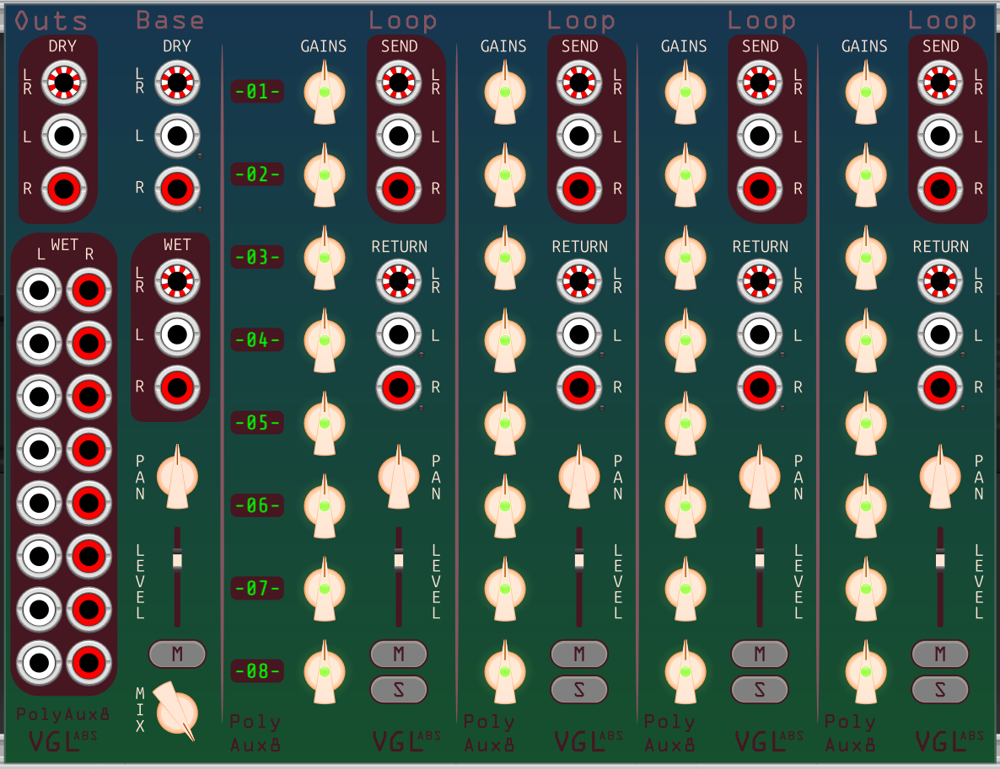

# VGLabs PolyAux: Track-preserving effects loop for VCV Rack

Ever wanted an aux effects loop that doesn't mix everything down to stereo first? Playing with quad or surround sound? 
Maybe you're a frequent user of MixMasterJr and Arena? Yeah, me too!  
Thus these modules were born.  
They take up to eight stereo tracks of input, polyphonically, and provide send/return ports for hooking up to polyphonic effects, creating an effects loop with eight individual tracks.
You can add another loop expander for each additional effect.

| Module | Description |
| -- | -- |
| **[BaseLoop](doc/base.md)** | Module with dry input, track labels, 1 effects loop, and wet output. You need this to get started. |
| **[Loop](doc/loop.md)** | Effects loop expander which goes to the right of the base, or the right of another loop. Stick on as many of these as you want. |
| **[Outs](doc/outs.md)** | Extra outputs expander which goes to the left of the base. Available here are dry audio (as summed by the dry input ports) and wet output, split into 16 mono channels. You can have one or none of these.|

## General Notes

Most ports come in sets of three: Interleaved, Left, and Right. These are polyphonic, and interleaved is arranged LRLRLRLRLRLRLRLR (like MixMaster's polyphonic outputs).  
For inputs, these are summed: you can plug into all three ports. Signals plugged into the left port and the left channels of the interleaved port are added together, and the same with the right channels.
If you plug a cable with more than 8 channels into a left or right port, a warning light goes on. Signals from channels above 8 on those ports are dropped.  
For outputs, the same signals will be seen on the interleaved port as on the left and right ports; the left and right ports have only the left and right channels respectively.

Each effects loop has gain and mute per track before the send, and overall level and pan after the return. Each loop can be muted or soloed. Master pan, level, and mute, as well as a wet/dry mix knob, are on the base.

Basic operation: Audio that goes in the dry input is summed as described above. The gain and mute are applied per track as set by the knobs, and made available at the send outputs.
The return inputs, with level and pan applied at each loop, are summed at the wet output.  
Audio is sent from module to module using Rack's expander mechanism, so sample delays between dry input and wet output will accumulate as you add more loops. 
This is unlikely to be audible unless you have a LOT of loops, but it's something to keep in mind if you need exact matching of triggers or anything along those lines. As always, scope is your friend.

No compression or limiting is applied, so it's possible to get very loud results. Beware!

The modules have a few colour themes included, which you can find in the right-click menu. They're defined in **[themes.json](../res/themes.json)**. Most of the theme code is from **[pachde's svg_theme repo](https://github.com/Paul-Dempsey/svg_theme)**.
On first run, themes.json will be copied to your rack user directory, so feel free to add more themes or alter the existing ones there.

An example of how you might wire things up:

