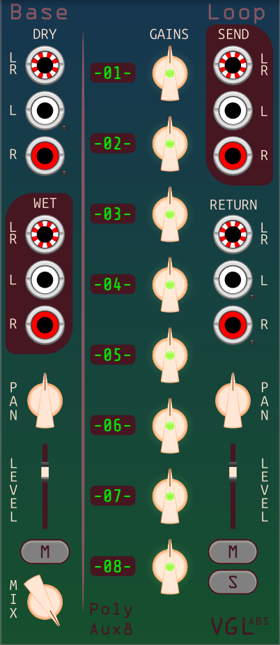

# BaseLoop - the base module

This is the core module that takes in dry audio and puts out wet audio, and that everything else hooks onto. It also contains one effects loop, documented at **[Loop](loop.md)**.  
It can have an Outs expander on its left, and Loop expanders on its right.

Inputs:
- Dry input: 

Outputs:
- Wet output: 

Controls:
- Pan: 
- Level: 
- Mute: 
- Mix:
- Track labels:

Menus:
- Master pan:
- Return pan:
- Mono input: 
	- Do nothing: Maintains separation of left and right.
	- Copy L to R (default): If a cable is connected to a left input, with no cable connected to the corresponding right input, the right input acts as if it has the same signal as the left input,
	in effect giving you a stereo signal where left and right are copies.  
If a cable is connected to a right input, with no cable connected to the corresponding left input, the left input has no signal.
- Themes: Pick one.

