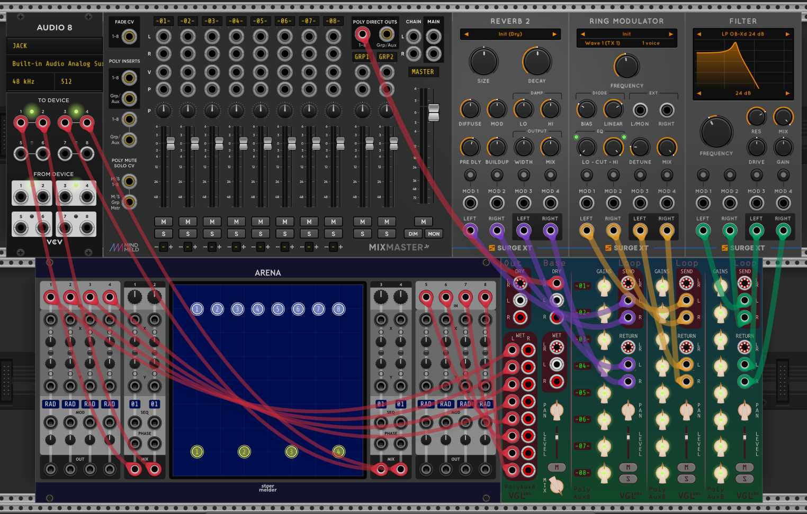

# VGLabs PolyAux: Track-preserving effects loop for VCV Rack

Ever wanted an effects loop that doesn't mix down to stereo? Playing with quad or surround sound? 
Maybe you're a frequent user of MixMasterJr and Arena? Yeah, me too!  
Thus these modules were born.

The modules have a few themes included, which you can find in the right-click menu.  
You can add your own in **[themes.json](../res/themes.json)** by copying an existing one and changing the name and colours. It's loaded at runtime, so no need to recompile.

Most ports come in sets of three: Interleaved, Left, and Right. These are polyphonic and interleaved is arranged LRLRLRLRLRLRLRLR (like MixMaster's polyphonic outputs).  
For inputs, these are summed: you can plug into all three ports. Signals plugged into the left port and the left channels of the interleaved port are added together, and the same with the right channels.
If you plug a cable with more than 8 channels into a left or right port, a warning light goes on. Signals from channels above 8 are dropped.  
For outputs, the same signals will be seen on the interleaved port as on the left and right ports; the left and right ports have only the left and right channels respectively.

Each effects loop has level and mute per track before the send, and overall level and pan after the return. Each loop can be muted or soloed. There's a master level and pan, and a wet/dry mix knob, on the base.

| Module | Description |
| -- | -- |
| **[BaseLoop](base.md)** | You need this to get started. Dry input, track labels, 1 effects loop, wet output. |
| **[Loop](loop.md)** | Effects loop expander which goes to the right of the base, or the right of another loop. Stick on as many of these as you want. |
| **[Out](outs.md)** | Extra outputs expander which goes to the left of the base. Dry audio (as summed by the dry input ports) and wet output, split into 16 mono channels. You might not need this.|

An example way to wire things up:

