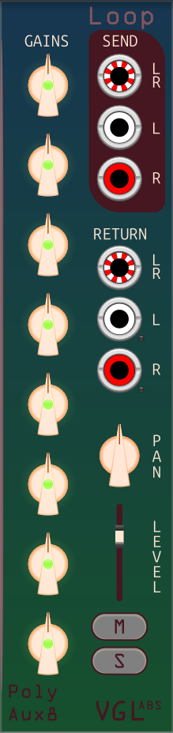

# Loop - send/return effects loop

This expander goes to the right of a base or another loop. It gets the dry audio from the base, applies the gains and mutes set by the knobs for each track, and puts that on the send output ports.  
The return signal is processed according to the pan and level controls, and sent back to the base to be added to the wet audio.  
Each loop can be muted or soloed.

Inputs:
- Return input: 

Outputs:
- Send output: 

Controls:
- Gains/Mutes:
- Pan: 
- Level: 
- Mute:
- Solo:

Menus:
- Return pan:
- Mono input: 
	- Do nothing: Maintains separation of left and right.
	- Copy L to R (default): If a cable is connected to a left input, with no cable connected to the corresponding right input, the right input acts as if it has the same signal as the left input,
	in effect giving you a stereo signal where left and right are copies.  
If a cable is connected to a right input, with no cable connected to the corresponding left input, the left input has no signal.
- Themes: Pick one.

