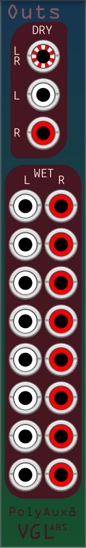

# Outs - additional outputs

This expander goes to the left of the base, and provides some additional outputs for your convenience.

Inputs:
<dl><dd>&ensp;&ensp;- None.</dd></dl>

Outputs: 
- Dry output provides the same dry audio that's passed to the loops.
- Wet output provides the same wet output available from the base, split into all 16 channels.  

Menu options:
- Wet output mono:
	- Do nothing: Maintains separation of left and right..
	- Add R to L (default): If a cable is connected to a left output, with no cable connected to the corresponding right output, the signal on the cable is the sum of the left and right signals.  
	  If a cable is connected to the right output, with no cable connected to the corresponding left output, the signal on the cable is the right signal only.

